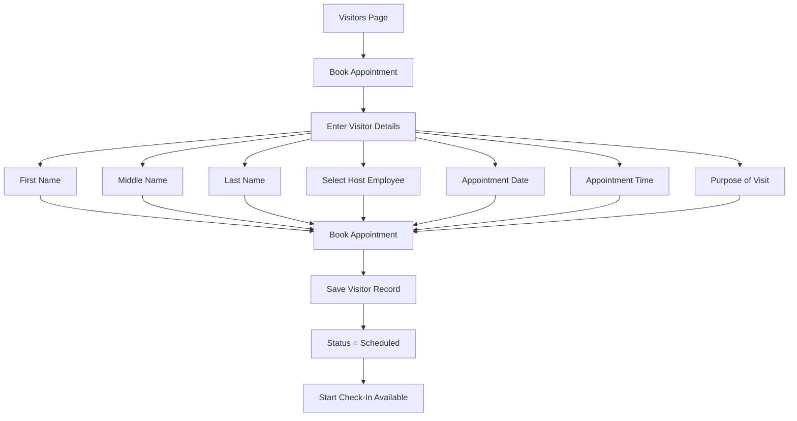

# Executive Workflow

```mermaid
flowchart TD

    A[Visitors Page] --> B[Book Appointment]

    B --> C[Enter Visitor Details]

    C --> D[First Name]
    C --> E[Middle Name]
    C --> F[Last Name]
    C --> G[Select Host Employee]
    C --> H[Appointment Date]
    C --> I[Appointment Time]
    C --> J[Purpose of Visit]

    D --> K[Book Appointment]
    E --> K
    F --> K
    G --> K
    H --> K
    I --> K
    J --> K

    K --> L[Save Visitor Record]

    L --> M[Status = Scheduled]

    M --> N[Start Check-In Available]
```