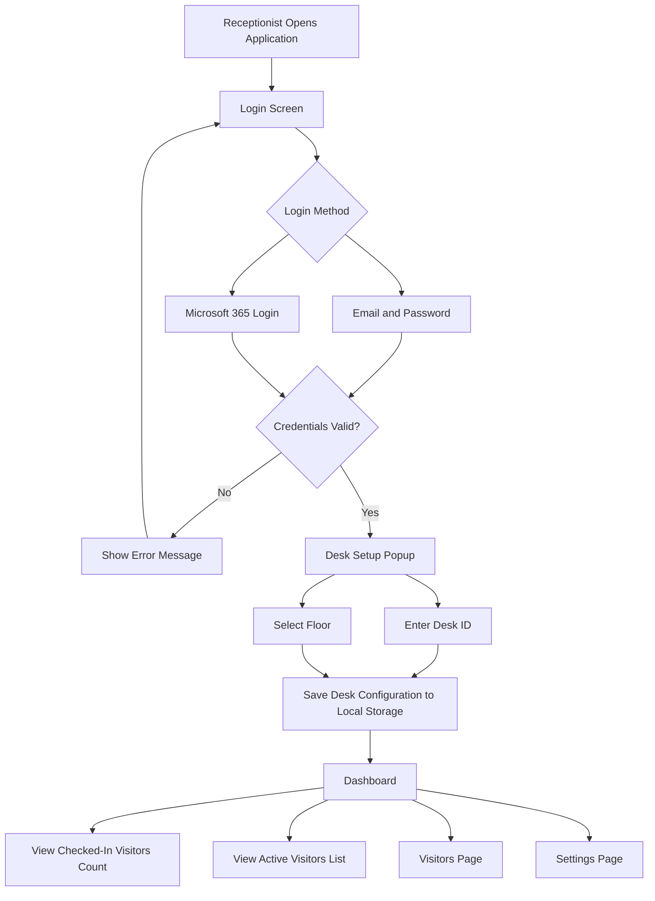

# Executive Workflow

```mermaid
flowchart TD

    A[Receptionist Opens Application] --> B[Login Screen]

    B --> C{Login Method}

    C --> D[Email and Password]
    C --> E[Microsoft 365 Login]

    D --> F{Credentials Valid?}
    E --> F

    F -->|No| G[Show Error Message]
    G --> B

    F -->|Yes| H[Desk Setup Popup]

    H --> I[Enter Desk ID]
    H --> J[Select Floor]

    I --> K[Save Desk Configuration to Local Storage]
    J --> K

    K --> L[Dashboard]

    L --> M[View Checked-In Visitors Count]
    L --> N[View Active Visitors List]
    L --> O[Visitors Page]
    L --> P[Settings Page]
```