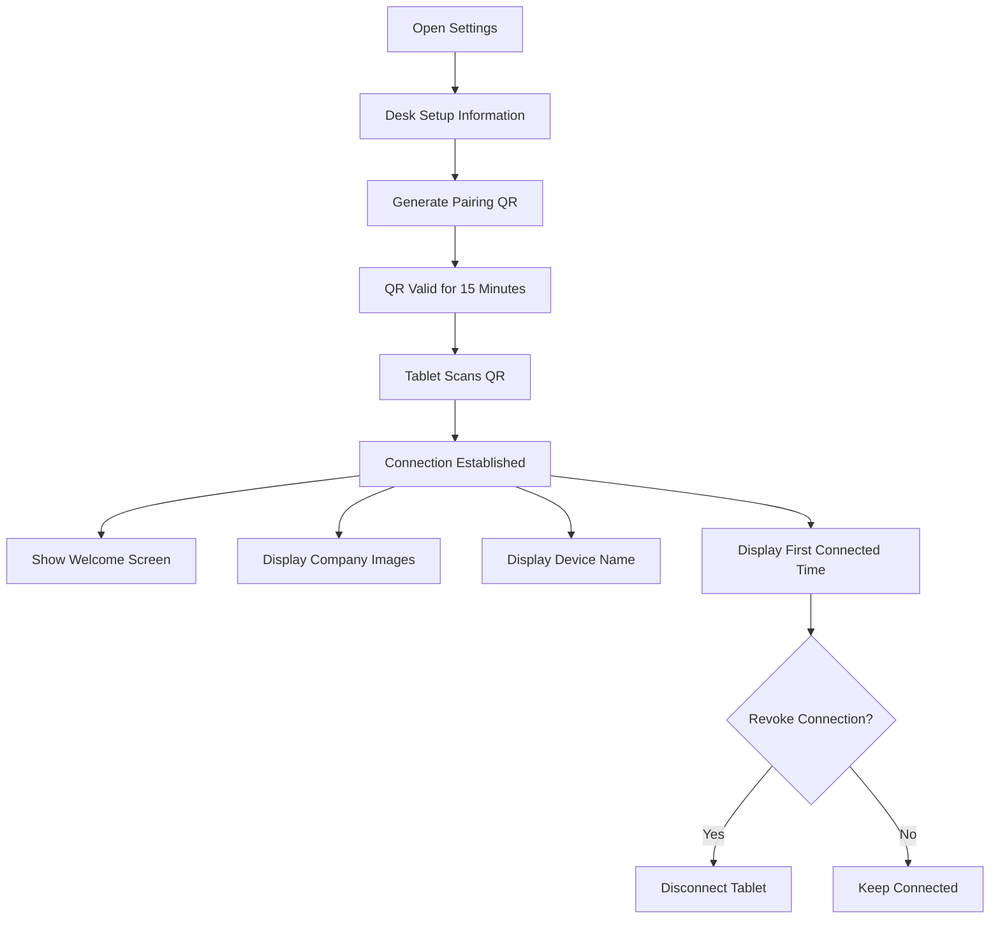

# Executive Workflow

```mermaid
flowchart TD
    A[Open Settings] --> B[Desk Setup Information]

    B --> C[Generate Pairing QR]

    C --> D[QR Valid for 15 Minutes]

    D --> E[Tablet Scans QR]

    E --> F[Connection Established]

    F --> G[Show Welcome Screen]
    F --> H[Display Company Images]

    F --> I[Display Device Name]
    F --> J[Display First Connected Time]

    J --> K{Revoke Connection?}

    K -->|Yes| L[Disconnect Tablet]
    K -->|No| M[Keep Connected]
```