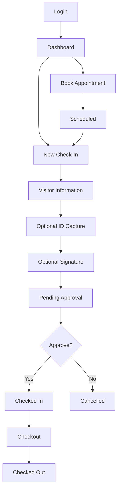

# Executive Workflow

```mermaid
flowchart TD

    A[Login] --> B[Dashboard]

    B --> C[Book Appointment]
    B --> D[New Check-In]

    C --> E[Scheduled]

    E --> D

    D --> F[Visitor Information]

    F --> G[Optional ID Capture]

    G --> H[Optional Signature]

    H --> I[Pending Approval]

    I --> J{Approve?}

    J -->|Yes| K[Checked In]

    J -->|No| L[Cancelled]

    K --> M[Checkout]

    M --> N[Checked Out]
```