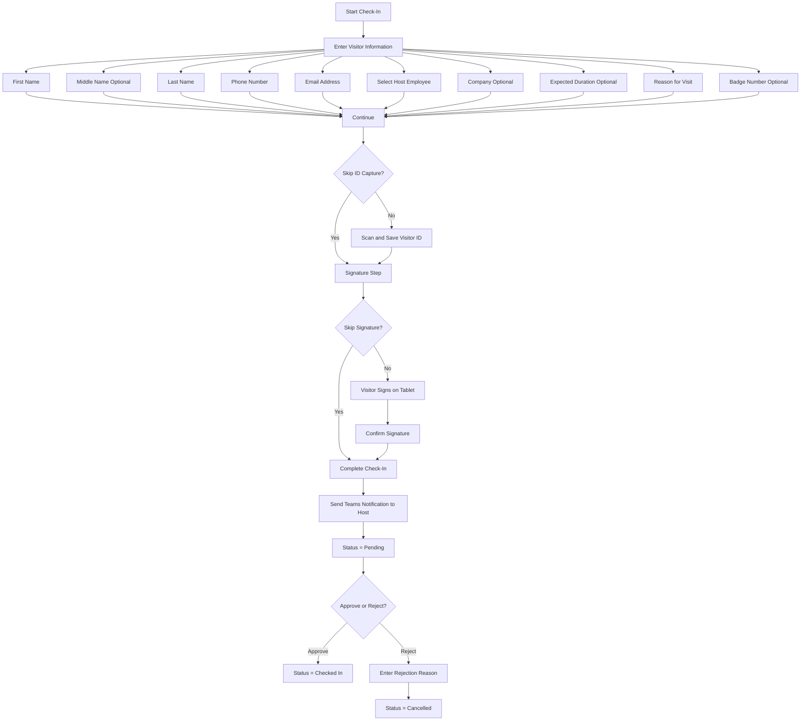

# Executive Workflow

```mermaid
flowchart TD

    A[Start Check-In] --> B[Enter Visitor Information]

    B --> C[First Name]
    B --> D[Middle Name Optional]
    B --> E[Last Name]
    B --> F[Phone Number]
    B --> G[Email Address]
    B --> H[Select Host Employee]
    B --> I[Company Optional]
    B --> J[Expected Duration Optional]
    B --> K[Reason for Visit]
    B --> L[Badge Number Optional]

    C --> M[Continue]
    D --> M
    E --> M
    F --> M
    G --> M
    H --> M
    I --> M
    J --> M
    K --> M
    L --> M

    M --> N{Skip ID Capture?}

    N -->|No| O[Scan and Save Visitor ID]
    N -->|Yes| P[Signature Step]

    O --> P

    P --> Q{Skip Signature?}

    Q -->|No| R[Visitor Signs on Tablet]
    Q -->|Yes| S[Complete Check-In]

    R --> T[Confirm Signature]
    T --> S

    S --> U[Send Teams Notification to Host]

    U --> V[Status = Pending]

    V --> W{Approve or Reject?}

    W -->|Approve| X[Status = Checked In]

    W -->|Reject| Y[Enter Rejection Reason]

    Y --> Z[Status = Cancelled]
```